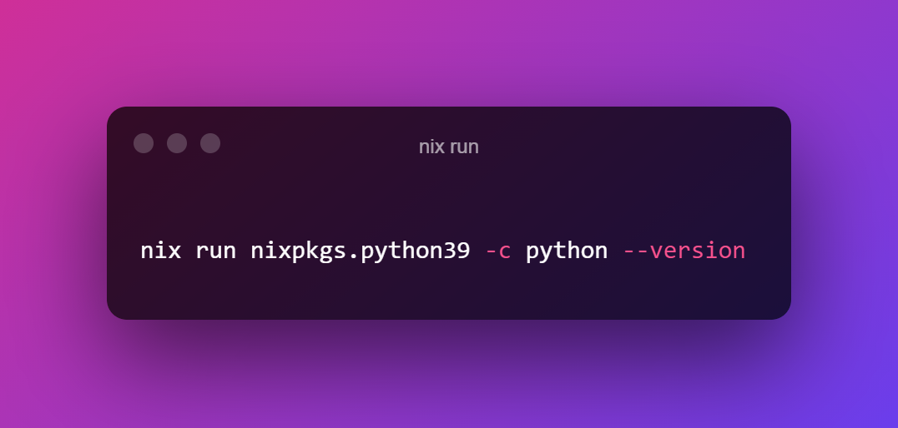

## No need to pollute your system environment
In the [last post](https://rameezkhan.me/per-project-packages-using-nix-and-direnv/) we discussed why it might not be wise to pollute your system (or global) environment by installing programs you'll only run once.

Often, these programs are installed and then forgotten about causing unnecessary bloat. 

A pristine system is easily maintained.

## When to use `nix-shell` or `nix run`
We also showed in the last post how we could use [nix-shell](https://rameezkhan.me/per-project-packages-using-nix-and-direnv/) to temporarily
bring programs into our path. This is still a viable option for running a once off command.

```bash
nix-shell -p python --command 'python --version'
```

An alternative is to use `nix run`.

```bash
nix run nixpkgs.python -c python --version
```

Or, if you're using [Nix Flakes](https://nixos.wiki/wiki/Flakes).
```sh
nix run nixpkgs#python -- --version
```

If you want to bring multiple programs into your path in one go, I would use `nix-shell` and make it a two step process. Otherwise, `nix run` is more convenient.

## I know what binary I want to run, but don't know in which nixpkg it lives
There is a nice project by Shopify called [Comma](https://github.com/Shopify/comma), which combines the usage of `nix run` and `nix-index` very nicely. There's a quick demo on how to use this [here](https://www.youtube.com/watch?v=VUM3Km_4gUg&list=PLRGI9KQ3_HP_OFRG6R-p4iFgMSK1t5BHs).

## Conclusion
The Nix ecosystem provides an easy mechanism for running once-off commands without polluting your system or global environment.

Till next time.

